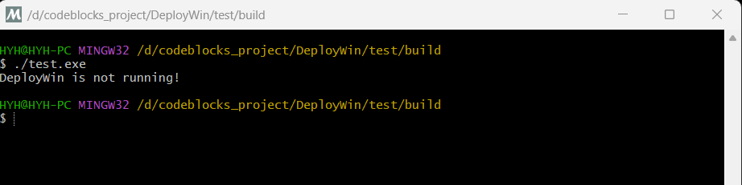
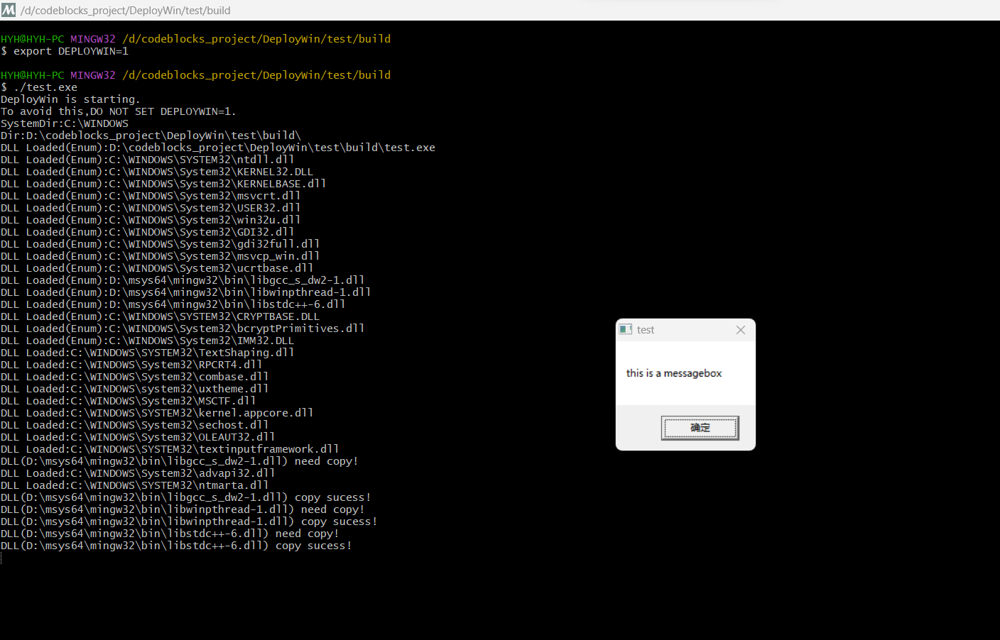
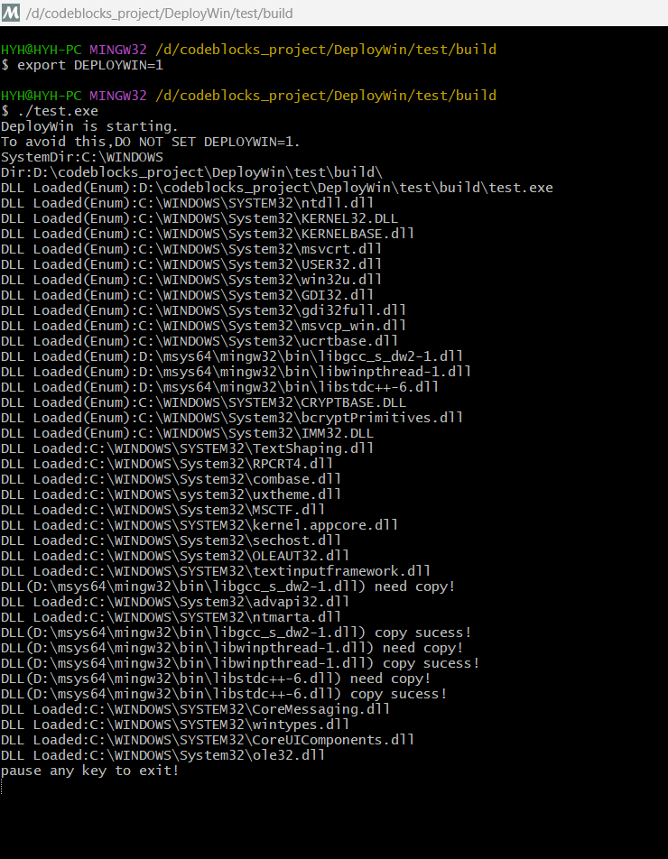
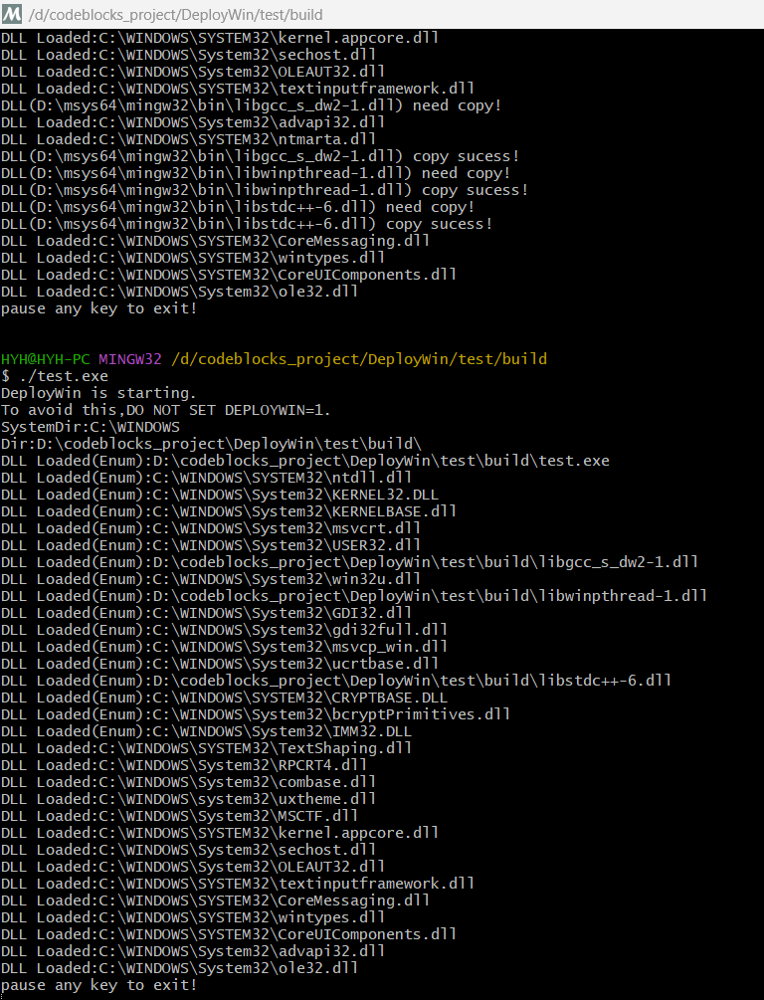

# 说明

在使用[MSYS2](https://www.msys2.org/)（包括mingw）与[Cygwin](http://cygwin.org/) 上开发Windows程序，经常遇到需要打包exe所需dll问题（如动态加载的dll）。

本库主要实现自动将依赖的dll拷贝到目标exe目录:

- 通过C++静态全局变量的构造函数启动拷贝线程。
- 通过环境变量触发dll拷贝功能。

可不修改原有C++代码，直接将本库链接进工程即可实现dll拷贝功能。

支持的环境变量：

|    环境变量名称    |                             说明                             |
| :----------------: | :----------------------------------------------------------: |
|     DEPLOYWIN      |            为1时启动dll拷贝，为其它值跳过dll拷贝             |
| DEPLOYWIN_AUTOEXIT | 当为大于0的数字时，表示自动退出的秒数。正常运行时不可设置此环境变量。通常用于CMake脚本的安装操作。 |


## 使用

- 操作系统：Windows 7及以上

本工程主要支持CMake构建的工程,其它类型项目请直接添加[src](src)下（不包括子目录）的cpp文件。

代码示例请参考[test](test)目录。

# 环境变量设置

## Windows Power shell

PowerShell通过env:操作环境变量:

```powershell
#启用dll拷贝
$env:DEPLOYWIN=1
#关闭dll拷贝
$env:DEPLOYWIN=0
```


## cmd

cmd中通过set命令设置环境变量:

```cmd
REM 启用dll拷贝
set DEPLOYWIN=1
REM 关闭dll拷贝
set DEPLOYWIN=1
```


## unix-like

unix-like包括msys2与cygwin,通过export导出环境变量:

```bash
#启用dll拷贝
export DEPLOYWIN=1
# 关闭dll拷贝
export DEPLOYWIN=0
```

# 测试程序截图

## MSYS2 MINGW32

未启用dll拷贝：



启用dll拷贝:







